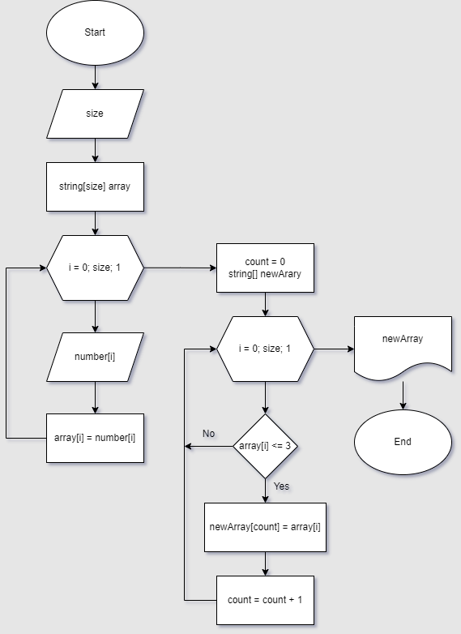

# Итоговая проверочная работа
## Необходимо:
1. Создать репозиторий на GitHub
2. Нарисовать блок-схему алгоритма (можно обойтись блок-схемой основной содержательной части, если вы выделяете её в отдельный метод)
3. Снабдить репозиторий оформленным текстовым описанием решения (файл README.md)
4. Написать программу, решающую поставленную задачу
5. Использовать контроль версий в работе над этим небольшим проектом (не должно быть так, что всё залито одним коммитом, как минимум этапы 2, 3, и 4 должны быть расположены в разных коммитах)
## Задача:
 Написать программу, которая из имеющегося массива строк формирует новый массив из строк, длина которых меньше, либо равна 3 символам. Первоначальный массив можно ввести с клавиатуры, либо задать на старте выполнения алгоритма. При решении не рекомендуется пользоваться коллекциями, лучше обойтись исключительно массивами.

## Выполнение:
- блок-схема алгоритма находится в файле: "BlockDiagram.png"

   А также в самом описании ниже:

* Текстовое описание решения задачи:

   Для решения задачи с заданным пользователем количества элементов в массиве (описание блок-схемы):
   
   1. Задаем количество элементов в массиве (size);
   2. Задаем одномерный массив с количеством элементов size;
   3. Для наполнения массива используем цикл;
   4. Пользователь вводит вручную значения элементов массива поочередно, size раз;
   5. На выходе из цикла получаем начальный массив, заполненный пользователем;
   6. Задаем счетчик шагов (count = 0) и окончательный массив;
   7. Для заполнения окончательного массива используем цикл;
   8. Если условие (array[i] <= 3), то есть количество символов в элементе массива выполняются, заполняем этими элементами окончательный массив. 
   9. По окончании проверки всех элементов начального массива в цикле имеем на выходе окончательный массив с элементами, длина которых меньше, либо равна 3 символам.
   10. Вывод на печать.